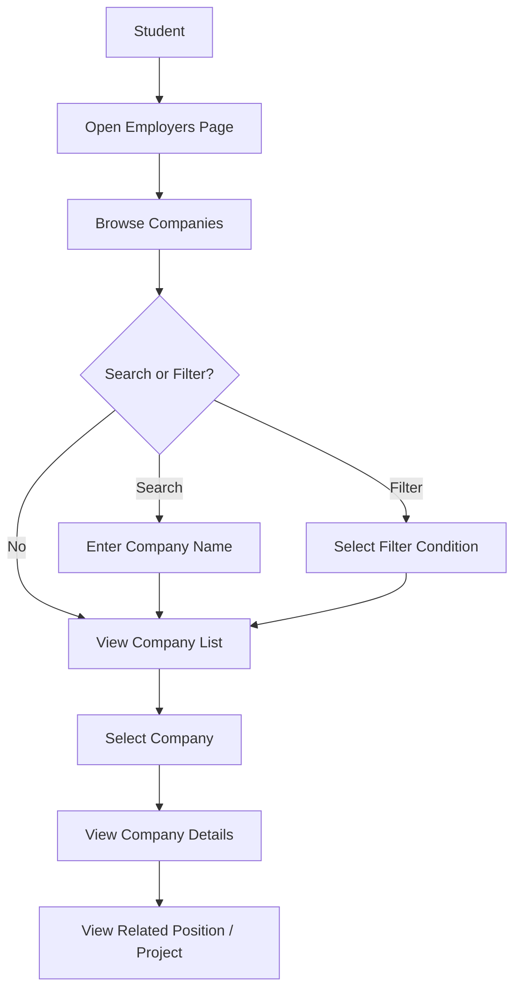
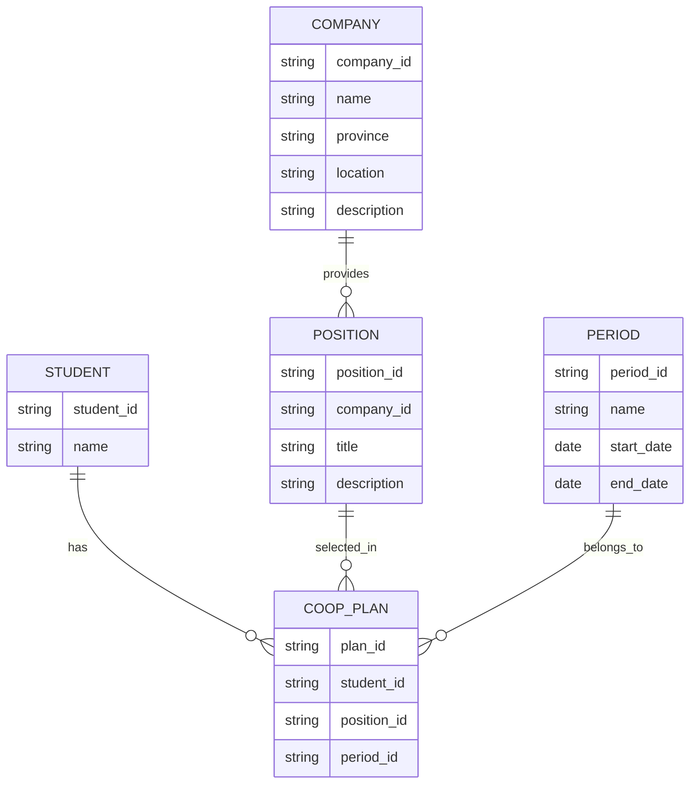
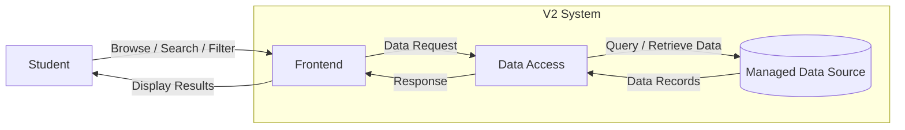
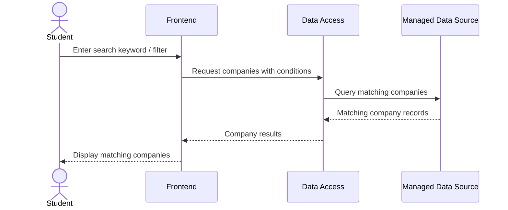

# V2 System Design

## 1. Context

เอกสารนี้ใช้เป็นข้อตกลงร่วมของทีมเกี่ยวกับภาพรวมการทำงานของระบบ V2 หลังจากกำหนด Project Direction และ System Boundary แล้ว

### V2 Direction

V2 เปลี่ยนระบบจาก Static Information Service ไปเป็น Dynamic Data Service โดยข้อมูลหลักของระบบจะถูกจัดเก็บใน Managed Data Source และสามารถเรียกดู ค้นหา และกรองตามเงื่อนไขได้

ข้อมูลหลักที่ V2 ต้องรองรับ ได้แก่

- Student
- Company
- Position / Project
- Period
- Coop Plan

V2 ยังไม่รวม Authentication, Role, Submission, Approval และ Workflow ซึ่งเป็นขอบเขตของ Version ถัดไป

---

# 2. Core User Flow

Core User Flow หลักของ V2 คือการที่นักศึกษาสามารถค้นหา กรอง และเรียกดูข้อมูลสถานประกอบการและตำแหน่งที่เกี่ยวข้องได้



## Main User Actions

นักศึกษาสามารถ

- Browse รายการสถานประกอบการ
- Search สถานประกอบการด้วยชื่อ
- Filter สถานประกอบการตามเงื่อนไข เช่น จังหวัด
- View Company Details
- View Position / Project ที่เกี่ยวข้องกับ Company

---

# 3. Data Model

ข้อมูลหลักของระบบ V2 ประกอบด้วย

- Student
- Company
- Position / Project
- Period
- Coop Plan



## Relationships

### Company → Position / Project

หนึ่งสถานประกอบการสามารถมีหลาย Position / Project ได้

```text
Company 1 ---- N Position
```

### Student → Coop Plan

นักศึกษาสามารถมี Coop Plan ที่เกี่ยวข้องกับตนเองได้

```text
Student 1 ---- N Coop Plan
```

### Position → Coop Plan

Coop Plan สามารถอ้างอิง Position / Project ที่เกี่ยวข้องได้

```text
Position 1 ---- N Coop Plan
```

### Period → Coop Plan

Coop Plan สามารถเชื่อมโยงกับรอบหรือช่วงเวลาของสหกิจศึกษาได้

```text
Period 1 ---- N Coop Plan
```

> Data Model ในเอกสารนี้เป็นภาพรวมของข้อมูลและ Relationship ของระบบ  
> รายละเอียด Physical Database เช่น PK, SK, GSI หรือโครงสร้างเฉพาะของ Database Technology จะออกแบบเพิ่มเติมใน Technical Design

---

# 4. V2 System Architecture

ภาพรวมของระบบ V2 ประกอบด้วย

1. Student
2. Frontend
3. Data Access
4. Managed Data Source



## Component Responsibilities

### Student

เป็น Primary User ของ V2

สามารถ

- Browse ข้อมูล
- Search ข้อมูล
- Filter ข้อมูล
- View Details

### Frontend

รับ Interaction จากผู้ใช้และแสดงผลข้อมูล

รับผิดชอบ

- แสดง Company / Position
- รับ Search Keyword
- รับ Filter Condition
- ส่งคำขอข้อมูล
- แสดงผลลัพธ์ที่ได้รับกลับมา

### Data Access

รับผิดชอบการเชื่อมระหว่าง Frontend และ Managed Data Source

หน้าที่หลัก

- รับ Data Request จาก Frontend
- ประมวลผลเงื่อนไขในการเรียกข้อมูล
- Query หรือ Retrieve ข้อมูลจาก Managed Data Source
- ส่งผลลัพธ์กลับไปยัง Frontend

รายละเอียดว่า Data Access จะ Implement ด้วย API, Backend Service, Serverless Function หรือแนวทางอื่น จะกำหนดใน Technical Design

### Managed Data Source

ใช้จัดเก็บข้อมูลหลักของระบบ V2 ได้แก่

- Student
- Company
- Position / Project
- Period
- Coop Plan

ข้อมูลหลักของระบบจะไม่ถูก Hard-code อยู่ใน Frontend เหมือน Static Data

---

# 5. Core Data Flow

## Scenario: Search and Filter Company

ตัวอย่าง Data Flow เมื่อ Student ค้นหาและกรองสถานประกอบการ



## Flow Description

1. Student เปิดหน้า Employers
2. Frontend แสดงข้อมูลสถานประกอบการ
3. Student ระบุ Search Keyword หรือ Filter Condition
4. Frontend ส่งเงื่อนไขไปยัง Data Access
5. Data Access ใช้เงื่อนไขเพื่อเรียกข้อมูลจาก Managed Data Source
6. Managed Data Source ส่ง Company Records ที่ตรงกับเงื่อนไขกลับ
7. Data Access ส่งผลลัพธ์กลับไปยัง Frontend
8. Frontend แสดงรายการ Company ที่ตรงกับเงื่อนไขให้ Student

---

# 6. Design Decisions

## Decision 1: Use Managed Data Source

### Decision

ข้อมูลหลักของ V2 จะถูกจัดเก็บใน Managed Data Source แทนการ Hard-code ข้อมูลไว้ใน Frontend

### Reason

V2 ต้องรองรับข้อมูลที่สามารถจัดเก็บ เรียกดู ค้นหา และกรองได้อย่างเป็นระบบ และข้อมูลจะถูกนำไปใช้ต่อใน Version ถัดไป

### Alternative

ใช้ Static JSON หรือ Hard-coded Data แบบ V1 ต่อไป

### Trade-off

Managed Data Source ทำให้ Architecture มีความซับซ้อนเพิ่มขึ้น แต่ช่วยให้จัดการและขยายข้อมูลได้ง่ายกว่า Static Data

---

## Decision 2: Separate Company and Position / Project

### Decision

Company และ Position / Project จะถูกแยกเป็นคนละ Entity

### Reason

Company หนึ่งแห่งสามารถมีหลาย Position / Project ได้

หากเก็บรวมกัน ข้อมูล Company เช่น ชื่อ ที่ตั้ง และรายละเอียดอาจถูกเก็บซ้ำหลายครั้ง

### Alternative

เก็บ Company และ Position / Project รวมอยู่ใน Record เดียว

### Trade-off

การแยก Entity ทำให้ต้องจัดการ Relationship เพิ่มขึ้น แต่ลดข้อมูลซ้ำและรองรับหลาย Position ต่อ Company ได้ง่ายกว่า

---

## Decision 3: Separate Period from Position / Project

### Decision

Period จะถูกแยกออกจาก Position / Project

### Reason

ข้อมูลตำแหน่งและช่วงเวลามีหน้าที่ต่างกัน และระบบต้องสามารถรองรับข้อมูลในหลายรอบเวลาได้

### Alternative

เก็บข้อมูล Period ไว้ภายใน Position / Project โดยตรง

### Trade-off

การแยก Period ทำให้มี Relationship เพิ่มขึ้น แต่ช่วยให้สามารถจัดการข้อมูลช่วงเวลาได้เป็นระบบและนำไปใช้กับข้อมูลอื่นได้ง่ายขึ้น

---

## Decision 4: Separate Data Access Responsibility from Frontend

### Decision

Logical Architecture จะแยก Responsibility ของ Data Access ออกจาก Frontend

### Reason

ช่วยแยกหน้าที่ของระบบออกเป็น

- User Interface
- Data Retrieval
- Data Storage

และทำให้ทีมสามารถพิจารณา Physical Architecture ได้โดยไม่กระทบกับ User Flow และ Data Flow หลักของระบบ

### Alternatives

- Frontend ติดต่อ Managed Data Source โดยตรง
- Frontend ติดต่อผ่าน API / Backend
- ใช้ Managed Service ที่รองรับการเข้าถึงข้อมูลโดยตรง

### Trade-off

การเพิ่ม Data Access Layer อาจเพิ่ม Component และ Complexity แต่ช่วยแยก Responsibility และรองรับการเปลี่ยน Architecture ในอนาคตได้ง่ายขึ้น

### Current Status

Physical Implementation ของ Data Access จะถูกกำหนดเพิ่มเติมจาก Technical Architecture Design

---

# 7. V2 Boundary Check

## Inside V2

ระบบ V2 รองรับ

- Dynamic Data
- Student Data
- Company Data
- Position / Project Data
- Period Data
- Coop Plan Data
- Browse Company
- Search Company
- Filter Company
- View Company Details
- View Position / Project
- Data Retrieval จาก Managed Data Source

## Outside V2

ระบบ V2 ยังไม่รวม

- Login
- Authentication
- Role-based Access Control
- Student Submit Coop Plan
- Approval / Reject Workflow
- การส่งกลับแก้ไข Plan
- Status Tracking
- Deadline Notification
- Dashboard
- Workflow ของอาจารย์และเจ้าหน้าที่

ความสามารถเหล่านี้จะถูกพัฒนาใน Version ถัดไปตาม Requirement ของโครงการ

---

# 8. Connection to Technical Design

System Design นี้กำหนดภาพรวมว่า

```text
Student
   ↓
Frontend
   ↓
Data Access
   ↓
Managed Data Source
```

หลังจากทีม Review และยอมรับ Design นี้แล้ว สามารถนำไปใช้เป็น Input สำหรับ Technical Design เพื่อกำหนด Technology จริง เช่น

- Managed Data Source ที่จะใช้
- Physical Database Schema
- Partition / Key / Index Design
- API หรือ Data Access Interface
- Backend Function
- Cloud Services
- Physical AWS Architecture

ตัวอย่าง หากทีมตัดสินใจใช้ Serverless Architecture อาจถูก Refine เป็น

```text
Student
   ↓
Frontend
   ↓
API Gateway
   ↓
Lambda
   ↓
DynamoDB
```

แต่รายละเอียดของ API Route, Lambda Function, PK, SK และ GSI จะถูกออกแบบใน Technical Design หลังจาก System Design ได้รับการ Review แล้ว
