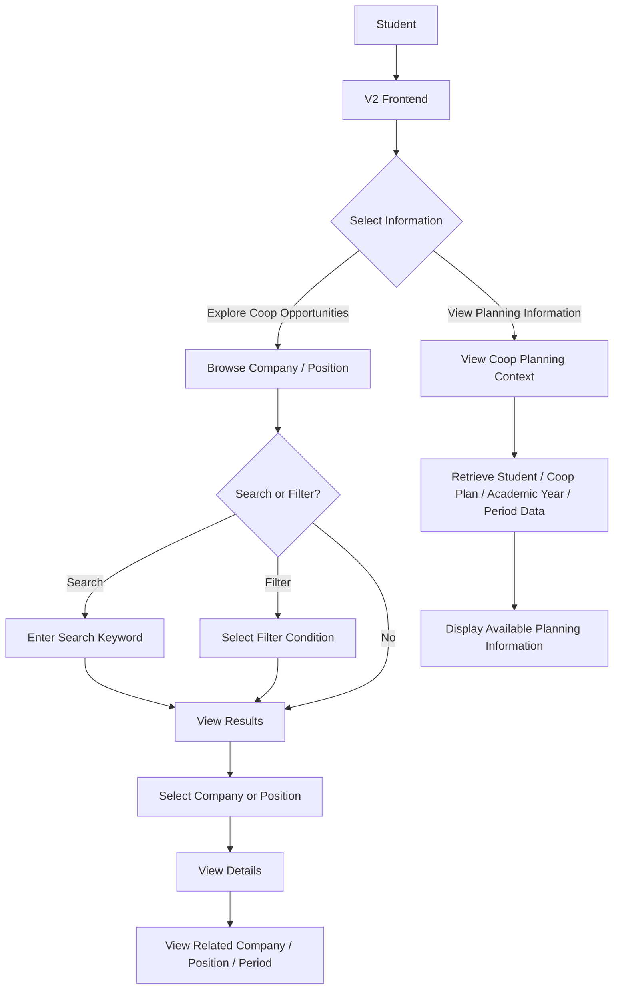
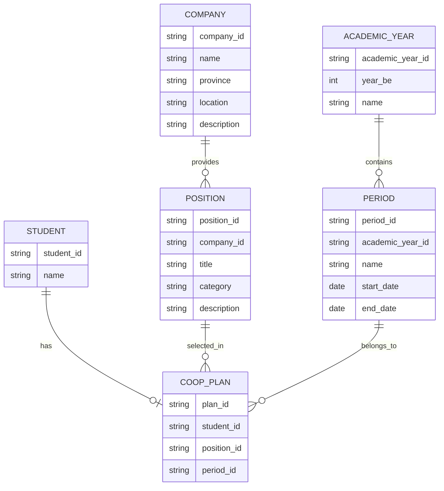
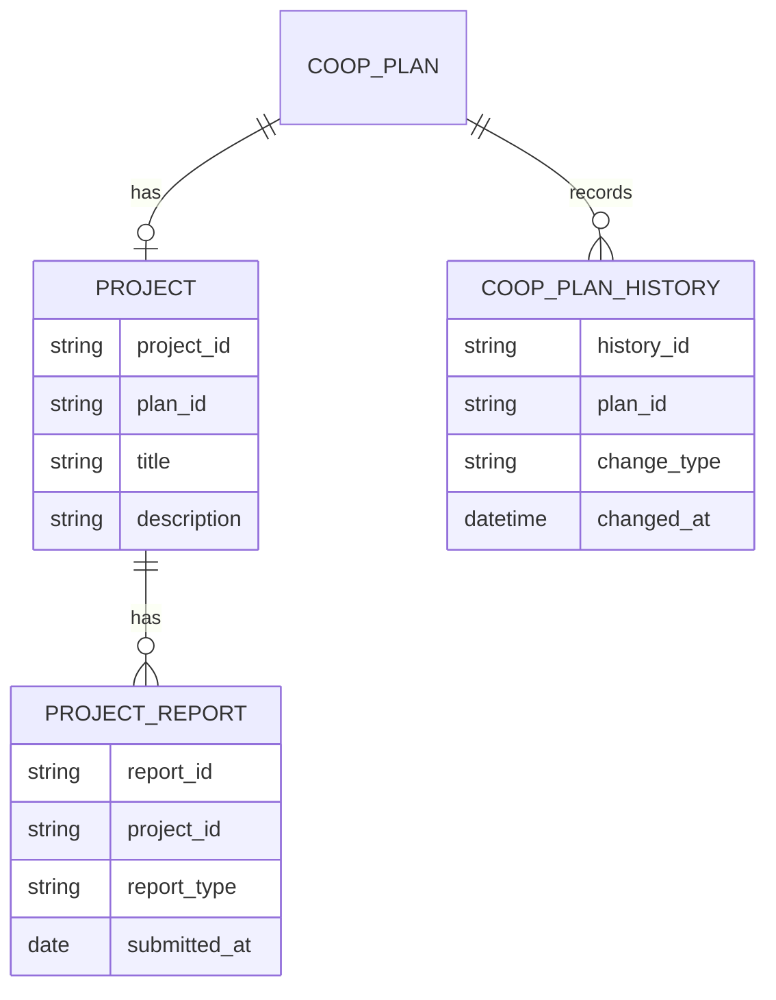
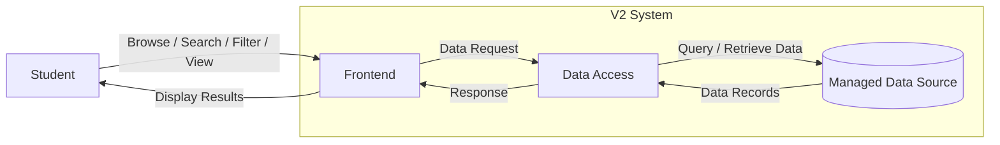
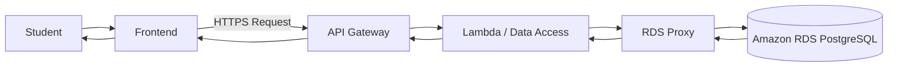
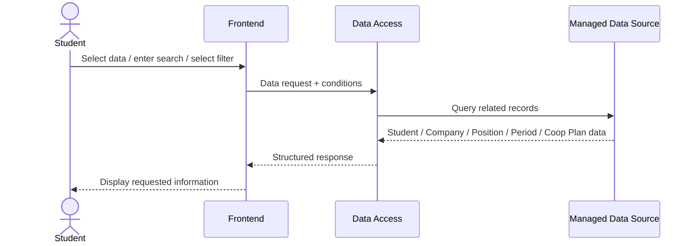

# V2 System Design

## 1. Context

เอกสารนี้ใช้เป็นข้อตกลงร่วมของทีมเกี่ยวกับภาพรวมการทำงานของระบบ V2 หลังจากกำหนด Project Direction และ System Boundary แล้ว

### V2 Direction

V2 เปลี่ยนระบบจาก Static Information Service ไปเป็น Dynamic Data Service โดยข้อมูลหลักของระบบจะถูกจัดเก็บใน Managed Data Source และสามารถเรียกดู ค้นหา และกรองตามเงื่อนไขที่เกี่ยวข้องได้

ข้อมูลหลักที่ V2 ต้องรองรับ ได้แก่

- Student
- Company
- Position
- Academic Year
- Period
- Coop Plan

ใน V2 ระบบเน้นการจัดเก็บและเรียกใช้ข้อมูลจาก Managed Data Source เพื่อให้ข้อมูลเหล่านี้สามารถเชื่อมโยงและนำไปใช้ต่อใน Version ถัดไปได้

V2 ยังไม่รวม Authentication, Role-based Access Control, การ Submit Coop Plan, Approval Workflow และ Status Workflow

### Position and Project Terminology

`Position` และ `Project` เป็นข้อมูลคนละประเภทและจะไม่ใช้คำรวมว่า `Position / Project`

- `Position` หมายถึงตำแหน่งงานหรือหน้าที่ที่สถานประกอบการเปิดรับนักศึกษาสหกิจ
- `Project` หมายถึงโครงงานที่นักศึกษาดำเนินการระหว่างการปฏิบัติสหกิจศึกษา

ใน V2 ใช้ `Position` เป็นข้อมูลหลักสำหรับการค้นหาและวางแผนสหกิจ

ส่วน `Project`, `Project Report` และประวัติการเปลี่ยนแปลงของ Coop Plan เป็นโครงสร้างที่เกี่ยวข้องกับ Version ถัดไป จึงแยกชื่อและ Relationship ไว้ให้ชัดเจน แต่ยังไม่เพิ่ม Workflow เหล่านี้ใน V2

---

# 2. Core User Flow

V2 รองรับข้อมูลมากกว่าข้อมูลสถานประกอบการเพียงอย่างเดียว

Core User Flow แบ่งเป็นสองส่วนหลัก

1. การค้นหาและเรียกดูโอกาสสหกิจ เช่น Company และ Position
2. การเรียกใช้ข้อมูลประกอบการวางแผน เช่น Student, Coop Plan, Academic Year และ Period


```mermaid
flowchart TD

    A[Student] --> B[V2 Frontend]

    B --> C{Select Information}

    C -->|Explore Coop Opportunities| D[Browse Company / Position]
    C -->|View Planning Information| E[View Coop Planning Context]

    D --> F{Search or Filter?}

    F -->|Search| G[Enter Search Keyword]
    F -->|Filter| H[Select Filter Condition]
    F -->|No| I[View Results]

    G --> I
    H --> I

    I --> J[Select Company or Position]
    J --> K[View Details]
    K --> L[View Related Company / Position / Period]

    E --> M[Retrieve Student / Coop Plan / Academic Year / Period Data]
    M --> N[Display Available Planning Information]
```

## Main User Actions

นักศึกษาสามารถ

- เรียกดูข้อมูลที่เกี่ยวข้องกับการวางแผนสหกิจ
- Browse รายการ Company
- Browse รายการ Position
- Search Company หรือ Position
- Filter ข้อมูลตามเงื่อนไขที่กำหนด
- View Company Details
- View Position Details
- View Period หรือ Academic Year ที่เกี่ยวข้อง
- เรียกดูข้อมูลที่เกี่ยวข้องกับ Coop Plan ตามขอบเขตข้อมูลที่ระบบเปิดให้ใช้งาน

> V2 ยังไม่มี Authentication ดังนั้นการควบคุมสิทธิ์การเข้าถึงข้อมูล Student หรือ Coop Plan รายบุคคลยังไม่ใช่ขอบเขตของ Version นี้  
> V2 เน้นให้ข้อมูลดังกล่าวมีโครงสร้างและสามารถเรียกใช้จาก Managed Data Source ได้ก่อน

---

# 3. Data Model

## 3.1 Core V2 Data Model

ข้อมูลหลักของ V2 ประกอบด้วย

- Student
- Company
- Position
- Academic Year
- Period
- Coop Plan


```mermaid
erDiagram

    STUDENT ||--o| COOP_PLAN : has

    COMPANY ||--o{ POSITION : provides

    POSITION ||--o{ COOP_PLAN : selected_in

    ACADEMIC_YEAR ||--o{ PERIOD : contains

    PERIOD ||--o{ COOP_PLAN : belongs_to

    STUDENT {
        string student_id
        string name
    }

    COMPANY {
        string company_id
        string name
        string province
        string location
        string description
    }

    POSITION {
        string position_id
        string company_id
        string title
        string category
        string description
    }

    ACADEMIC_YEAR {
        string academic_year_id
        int year_be
        string name
    }

    PERIOD {
        string period_id
        string academic_year_id
        string name
        date start_date
        date end_date
    }

    COOP_PLAN {
        string plan_id
        string student_id
        string position_id
        string period_id
    }
```

---

## 3.2 Relationships

### Student → Coop Plan

ในข้อมูลที่มีอยู่ ยังไม่มี Requirement ที่ระบุว่านักศึกษาหนึ่งคนต้องสามารถมีหลาย Coop Plan พร้อมกัน

ดังนั้น V2 กำหนดให้ Student หนึ่งคนสามารถมี Coop Plan ได้ไม่เกินหนึ่งแผน

```text
Student 1 ---- 0..1 Coop Plan
```

การที่ยังไม่มี Coop Plan เป็นไปได้ เนื่องจาก V2 ยังไม่รวม Workflow การสร้างหรือ Submit Coop Plan

หากในอนาคตต้องเก็บประวัติการเปลี่ยนแปลงของแผน จะไม่สร้าง Coop Plan หลายรายการเพื่อใช้แทน History แต่จะแยก History เป็น Entity ต่างหาก

---

### Company → Position

หนึ่ง Company สามารถมีหลาย Position ได้

```text
Company 1 ---- N Position
```

Position ต้องอ้างอิง Company ที่เกี่ยวข้อง

---

### Position → Coop Plan

Position เดียวสามารถถูกอ้างอิงโดย Coop Plan ของนักศึกษาหลายคนได้

แต่ Coop Plan หนึ่งแผนจะอ้างอิง Position ที่เกี่ยวข้องหนึ่งรายการ

```text
Position 1 ---- N Coop Plan
```

---

### Academic Year → Period

Academic Year ใช้แยกข้อมูลของแต่ละปีการศึกษา

หนึ่ง Academic Year สามารถมีหลาย Period ได้

```text
Academic Year 1 ---- N Period
```

ตัวอย่าง

```text
Academic Year: 2569

├── Period: ภาคการศึกษาที่ 1
├── Period: ภาคการศึกษาที่ 2
└── Period: ภาคฤดูร้อน
```

การแยก Academic Year ออกจาก Period ช่วยให้ข้อมูลแต่ละปีไม่ปะปนกัน และสามารถใช้ Period เดิมในโครงสร้างของปีการศึกษาที่แตกต่างกันได้

---

### Period → Coop Plan

Coop Plan เชื่อมโยงกับ Period ที่นักศึกษาจะเข้าร่วมสหกิจศึกษา

```text
Period 1 ---- N Coop Plan
```

Academic Year ของ Coop Plan สามารถทราบได้ผ่าน Period ที่ Coop Plan อ้างอิง

จึงไม่จำเป็นต้องเก็บ `academic_year_id` ซ้ำใน Coop Plan

---

## 3.3 Future Data Model Extension

เพื่อไม่ให้คำว่า `Position` และ `Project` สับสนกัน ระบบกำหนด Concept ของ Project แยกออกจาก Position ตั้งแต่ระดับ Data Model

แต่ Entity ต่อไปนี้ยังไม่ใช่ Workflow ที่ต้อง Implement ใน V2


```mermaid
erDiagram

    COOP_PLAN ||--o| PROJECT : has

    PROJECT ||--o{ PROJECT_REPORT : has

    COOP_PLAN ||--o{ COOP_PLAN_HISTORY : records

    PROJECT {
        string project_id
        string plan_id
        string title
        string description
    }

    PROJECT_REPORT {
        string report_id
        string project_id
        string report_type
        date submitted_at
    }

    COOP_PLAN_HISTORY {
        string history_id
        string plan_id
        string change_type
        datetime changed_at
    }
```

### Coop Plan → Project

Coop Plan หนึ่งแผนสามารถเชื่อมโยงกับ Project ของนักศึกษาได้ไม่เกินหนึ่ง Project

```text
Coop Plan 1 ---- 0..1 Project
```

Project เป็นโครงงานระหว่างการฝึกสหกิจ ไม่ใช่ Position ที่บริษัทเปิดรับ

### Project → Project Report

Project หนึ่งรายการสามารถมีรายงานหลายรายการได้

```text
Project 1 ---- N Project Report
```

เช่น Proposal, Progress Report หรือ Final Report

### Coop Plan → Coop Plan History

หาก Version ถัดไปต้องเก็บประวัติการเปลี่ยนแปลงของ Coop Plan จะใช้ Entity แยก

```text
Coop Plan 1 ---- N Coop Plan History
```

วิธีนี้ช่วยให้ Coop Plan ยังคงเป็น Current State เพียงรายการเดียว และ History ไม่ถูกนำไปปะปนกับจำนวน Coop Plan ของ Student

> Project, Project Report และ Coop Plan History ถูกระบุไว้เพื่อให้ Data Model สามารถต่อยอดได้อย่างชัดเจน  
> การสร้าง Project, การส่ง Report และการบันทึก History ยังไม่ใช่ Core Function ของ V2

---

# 4. V2 System Architecture

ภาพรวม Logical Architecture ของ V2 ประกอบด้วย

1. User
2. Frontend
3. Data Access
4. Managed Data Source


```mermaid
flowchart LR

    A[Student]

    subgraph V2[V2 System]
        B[Frontend]
        C[Data Access]
        D[(Managed Data Source)]
    end

    A -->|Browse / Search / Filter / View| B

    B -->|Data Request| C

    C -->|Query / Retrieve Data| D

    D -->|Data Records| C

    C -->|Response| B

    B -->|Display Results| A
```

## Component Responsibilities

### Student

เป็น Primary User ของ V2

สามารถ

- Browse ข้อมูล
- Search ข้อมูล
- Filter ข้อมูล
- View Details
- เข้าถึงข้อมูลที่เกี่ยวข้องกับการวางแผนสหกิจตามขอบเขตของ V2

### Frontend

รับ Interaction จากผู้ใช้และแสดงผลข้อมูล

รับผิดชอบ

- แสดงข้อมูล Company
- แสดงข้อมูล Position
- แสดงข้อมูล Academic Year และ Period ที่เกี่ยวข้อง
- แสดงข้อมูล Planning Context ที่ระบบอนุญาตให้เรียกดู
- รับ Search Keyword
- รับ Filter Condition
- ส่ง Data Request
- แสดง Response จาก Data Access

### Data Access

รับผิดชอบการเชื่อมระหว่าง Frontend และ Managed Data Source

หน้าที่หลัก

- รับ Data Request จาก Frontend
- ประมวลผล Search / Filter Condition
- Query หรือ Retrieve ข้อมูล
- เชื่อมข้อมูลระหว่าง Entity ที่เกี่ยวข้อง
- ส่งผลลัพธ์กลับไปยัง Frontend

### Managed Data Source

ใช้จัดเก็บข้อมูลหลักของ V2 ได้แก่

- Student
- Company
- Position
- Academic Year
- Period
- Coop Plan

ข้อมูลหลักของระบบจะไม่ถูก Hard-code อยู่ใน Frontend แบบ V1

---

## Current Technical Direction

Logical Architecture ด้านบนสามารถ Implement ด้วย Architecture ปัจจุบันของทีมได้ดังนี้


```mermaid
flowchart LR

    A[Student]
    B[Frontend]
    C[API Gateway]
    D[Lambda / Data Access]
    E[RDS Proxy]
    F[(Amazon RDS PostgreSQL)]

    A --> B
    B -->|HTTPS Request| C
    C --> D
    D --> E
    E --> F

    F --> E
    E --> D
    D --> C
    C --> B
    B --> A
```

RDS PostgreSQL ทำหน้าที่เป็น Managed Data Source

Lambda ทำหน้าที่เป็น Data Access / Application Logic

API Gateway เป็น Interface ระหว่าง Frontend และ Data Access

RDS Proxy ช่วยจัดการ Connection ระหว่าง Lambda และ RDS

รายละเอียดของ Resource, Security Group, Schema และ Deployment จะกำหนดใน Technical Design และ Infrastructure Implementation

---

# 5. Core Data Flow

Core Data Flow ของ V2 ไม่จำกัดเฉพาะ Company แต่ใช้ Pattern เดียวกันกับข้อมูลหลักของระบบ


```mermaid
sequenceDiagram

    actor Student

    participant Frontend
    participant DataAccess as Data Access
    participant DataSource as Managed Data Source

    Student->>Frontend: Select data / enter search / select filter

    Frontend->>DataAccess: Data request + conditions

    DataAccess->>DataSource: Query related records

    DataSource-->>DataAccess: Student / Company / Position / Period / Coop Plan data

    DataAccess-->>Frontend: Structured response

    Frontend-->>Student: Display requested information
```

## Scenario A: Search and Filter Company / Position

1. Student เปิดหน้าค้นหาข้อมูลสหกิจ
2. Frontend ขอ Company และ Position จาก Data Access
3. Student ระบุ Search Keyword หรือ Filter Condition
4. Frontend ส่งเงื่อนไขไปยัง Data Access
5. Data Access Query Company หรือ Position จาก Managed Data Source
6. Data Source ส่ง Record ที่ตรงกับเงื่อนไขกลับ
7. Data Access เชื่อมข้อมูลที่เกี่ยวข้อง เช่น Position → Company
8. Frontend แสดงผลลัพธ์ให้ Student

ตัวอย่าง

```text
Student
   ↓
Search "Data Engineer"
   ↓
Frontend
   ↓
Data Access
   ↓
Position + Company
   ↓
Managed Data Source
   ↓
Matching Records
   ↓
Frontend
   ↓
Student
```

## Scenario B: Retrieve Coop Planning Data

ข้อมูล Student และ Coop Plan เป็นข้อมูลหลักของ Managed Data Source เช่นเดียวกับ Company และ Position

```text
Frontend
   ↓
Request planning data
   ↓
Data Access
   ↓
Student
+ Coop Plan
+ Position
+ Period
+ Academic Year
   ↓
Structured Response
   ↓
Frontend
```

V2 เน้นการจัดเก็บและเรียกใช้ข้อมูลดังกล่าวอย่างเป็นระบบ

Workflow สำหรับการสร้าง แก้ไข Submit หรือ Approve Coop Plan จะพัฒนาใน Version ถัดไป

---

# 6. Design Decisions

## Decision 1: Use Managed Data Source

### Decision

ข้อมูลหลักของ V2 จะถูกจัดเก็บใน Managed Data Source แทนการ Hard-code ข้อมูลไว้ใน Frontend

### Reason

V2 ต้องรองรับข้อมูลที่สามารถจัดเก็บ เรียกดู ค้นหา และกรองได้อย่างเป็นระบบ

ข้อมูลยังต้องสามารถเชื่อมโยงกันและนำไปใช้ต่อใน Version ถัดไป

### Alternative

ใช้ Static JSON หรือ Hard-coded Data แบบ V1 ต่อไป

### Trade-off

Managed Data Source เพิ่มความซับซ้อนด้าน Infrastructure และ Data Access แต่ช่วยลดการแก้ข้อมูลใน Frontend และรองรับ Dynamic Data ได้เหมาะสมกว่า

---

## Decision 2: Separate Company and Position

### Decision

Company และ Position เป็นคนละ Entity

### Reason

หนึ่ง Company สามารถมีหลาย Position ได้

หากเก็บรวมใน Record เดียว ข้อมูล Company เช่น ชื่อ ที่ตั้ง และรายละเอียดจะถูกทำซ้ำทุก Position

### Alternative

เก็บข้อมูล Company และ Position รวมกัน

### Trade-off

การแยก Entity ทำให้ต้อง Query Relationship เพิ่มขึ้น แต่ลดข้อมูลซ้ำและรักษาความสัมพันธ์ได้ชัดเจนกว่า

---

## Decision 3: Separate Position and Project

### Decision

Position และ Project เป็นคนละ Entity และไม่ใช้คำว่า `Position / Project` รวมกัน

### Reason

Position หมายถึงตำแหน่งที่ Company เปิดรับ

Project หมายถึงโครงงานที่ Student ทำระหว่างสหกิจ

ทั้งสองข้อมูลมี Lifecycle และ Relationship ต่างกัน

### Alternative

ใช้ Entity เดียวหรือใช้คำว่า Position / Project ต่อไป

### Trade-off

การแยก Concept ทำให้จำนวน Entity เพิ่มขึ้น แต่ลดความสับสนและรองรับ Project Report ใน Version ถัดไปได้ชัดเจนกว่า

---

## Decision 4: Student Has One Current Coop Plan

### Decision

Student หนึ่งคนมี Current Coop Plan ได้ไม่เกินหนึ่งรายการ

### Reason

Requirement ปัจจุบันยังไม่มีข้อมูลยืนยันว่านักศึกษาต้องสามารถมีหลาย Coop Plan พร้อมกัน

หากในอนาคตต้องบันทึกการเปลี่ยนแปลง จะใช้ Coop Plan History แทนการสร้าง Coop Plan ซ้ำ

### Alternative

กำหนด Student 1:N Coop Plan แล้วใช้แต่ละ Record เป็น Version ของแผน

### Trade-off

การใช้ 1:1 ทำให้ Current Plan ชัดเจนและ Query ง่ายกว่า แต่ต้องมี History Entity เพิ่มหากต้องเก็บประวัติใน Version ถัดไป

---

## Decision 5: Separate Academic Year and Period

### Decision

Academic Year และ Period แยกเป็นคนละ Entity

### Reason

ระบบต้องรองรับข้อมูลหลายปีการศึกษา และหนึ่ง Academic Year สามารถมีหลาย Period

การแยก Academic Year ทำให้ข้อมูลในแต่ละปีไม่ปะปนกัน

### Alternative

เก็บ Academic Year เป็นข้อความซ้ำอยู่ในแต่ละ Entity

### Trade-off

การแยก Entity เพิ่ม Relationship แต่ลดข้อมูลซ้ำและทำให้ Filter / Query ตามปีการศึกษาได้เป็นระบบ

---

## Decision 6: Separate Data Access Responsibility from Frontend

### Decision

Frontend จะไม่ติดต่อ Database โดยตรง แต่ใช้ Data Access เป็นตัวกลาง

### Reason

ช่วยแยก Responsibility ออกเป็น

- User Interface
- Data Retrieval / Application Logic
- Data Storage

และไม่เปิด Database Credential ให้ Frontend

### Alternatives

- Frontend ติดต่อ Database โดยตรง
- Frontend ติดต่อผ่าน API / Backend / Serverless Function

### Trade-off

Data Access เพิ่ม Component ใน Architecture แต่ช่วยด้าน Security, Maintainability และรองรับการเปลี่ยนแปลง Data Source ได้ง่ายขึ้น

---

# 7. V2 Boundary Check

## Inside V2

ระบบ V2 รองรับ

- Dynamic Data
- Student Data
- Company Data
- Position Data
- Academic Year Data
- Period Data
- Coop Plan Data
- Managed Data Source
- Data Retrieval
- Browse Company
- Browse Position
- Search Company
- Search Position
- Filter Company
- Filter Position
- View Company Details
- View Position Details
- Relationship ระหว่างข้อมูลหลักของระบบ

## Outside V2

ระบบ V2 ยังไม่รวม

- Login
- Authentication
- Role-based Access Control
- Student Submit Coop Plan
- Approval / Reject Workflow
- การส่งกลับแก้ไข Coop Plan
- Status Tracking Workflow
- Deadline Notification
- Dashboard
- การสร้างและจัดการ Project
- การส่ง Project Report
- Coop Plan History Workflow
- Workflow ของอาจารย์และเจ้าหน้าที่
- Automatic synchronization กับ External System

Project, Project Report และ Coop Plan History ถูกแยก Concept และ Relationship ไว้ใน Data Model เพื่อรองรับ Version ถัดไป แต่ยังไม่ใช่ Feature ที่ต้อง Implement ใน V2

---

# 8. Alignment with Project Direction and System Boundary

V2 System Design นี้ยังคง Direction หลักของ Project คือ

```text
Static Information Service
        ↓
Dynamic Data Service
        ↓
Managed Data Source
        ↓
Search / Filter / Retrieve
```

การแก้ไข Data Model ในเอกสารนี้เป็นการ Refine ความหมายและ Relationship ให้ชัดเจนขึ้น ได้แก่

- Position และ Project แยกออกจากกัน
- Student มี Current Coop Plan ได้ไม่เกินหนึ่งรายการ
- ประวัติ Coop Plan แยกเป็น Coop Plan History
- เพิ่ม Academic Year เพื่อรองรับข้อมูลหลายปีการศึกษา
- Project และ Project Report ถูกแยกเป็น Entity สำหรับการต่อยอดใน Version ถัดไป

Direction ของ V2 ยังคงไม่เพิ่ม Authentication, Submission, Approval หรือ Workflow

---

# 9. Connection to Technical Design

Logical Architecture ของ V2 คือ

```text
Student
   ↓
Frontend
   ↓
Data Access
   ↓
Managed Data Source
```

Technical Architecture ปัจจุบันสามารถ Refine เป็น

```text
Student
   ↓
Frontend
   ↓
API Gateway
   ↓
Lambda
   ↓
RDS Proxy
   ↓
Amazon RDS PostgreSQL
```

รายละเอียดระดับ Technical Design เช่น

- Physical Database Schema
- Primary Key / Foreign Key
- Constraint
- Index
- API Routes
- Lambda Functions
- Security Groups
- RDS Configuration
- Deployment

จะถูกกำหนดและพัฒนาใน Technical Issues ที่เกี่ยวข้อง

System Design นี้จึงทำหน้าที่กำหนดความหมายของข้อมูล Relationship และ Data Flow กลางที่ทุกส่วนของ V2 ใช้ร่วมกัน
